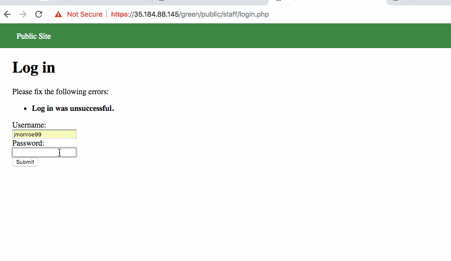
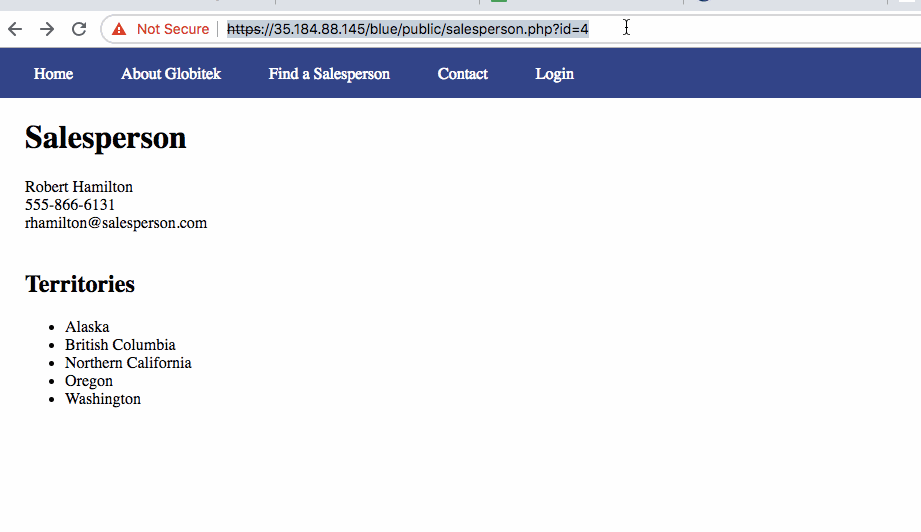

# CodePath-Week-8

Real names like jmonroe99 have bolded feedback, fake ones are not bolded.

In the logged in account, we can see that there is a user that should not be public. The id of that page is 10, so if we change the html on the public site to id=10 we can find the page, even if it is not linked.

https://35.184.88.145/blue/public/salesperson.php?id='OR SLEEP(5)=0 --’ We make the page wait a little bit before going to the first salesperson

Forces javascript alert on the user

Change the inputs by making user click on malicious code.

With two browsers, you can log into one without knowing the password. Log in normally into one and get the session ID using the site given a while ago. Then put that Session ID into the other browser (the one without the login info) and log into the website. It should automatically put you in as the account.
